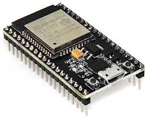
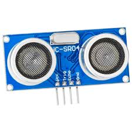

# amIAtMyDesk
a web app that says whether or not I'm at my desk

## Ingredients

### 1x ESP-32 running Micropython 

### 1x HC-SR04 ultrasonic rangefinder 

### 1x Internet 

## Step One: Find Range

Hook the sensor up to the board, figure out the correct proximity for determining whether or not I'm at my desk. Then maybe start by having a light turn on if I'm at my desk, say.

### Question: Why Micropython As Opposed To Arduino?

Either would work. The network stuff will be easier with Micropython, because I'll be able to use the socket library. Also, I have less experience with Micropython and want to practice it. Furthermore, I think it would be more extensible if I want to add more features in the future - which I do.